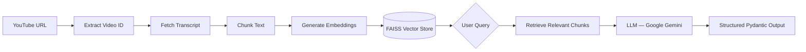

# NexusAI — YouTube Video RAG Engine

Take a YouTube URL → fetch transcript → chunk & embed it → query, summarize, and extract insights with structured output.

## High-Level Architecture



## Proposed Tech Stack

| Layer | Technology | Why |
|---|---|---|
| API Framework | FastAPI | Already in use |
| Transcript | `youtube-transcript-api` | Already installed |
| Text Splitting | `langchain-text-splitters` | Mature, configurable chunking |
| Embeddings | `langchain-google-genai` (Gemini `embedding-001`) | Free tier, high quality |
| Vector Store | FAISS (via `langchain-community` + `faiss-cpu`) | Fast, local, no infra needed |
| LLM | Google Gemini 2.0 Flash (via `langchain-google-genai`) | Free tier, fast, supports structured output |
| Structured Output | Pydantic v2 models | Already a dependency, works natively with LangChain's `with_structured_output()` |

> [!IMPORTANT]
> **LLM Provider Choice**: This plan uses **Google Gemini** (free tier) via `langchain-google-genai`. If you prefer OpenAI, Anthropic, or Ollama (local), let me know and I'll swap it out. The architecture stays the same — only the LLM/embedding provider changes.

## Proposed Project Structure

```
NexusAI/
├── main.py                          # FastAPI app entry point
├── .env                             # API keys (GOOGLE_API_KEY)
├── pyproject.toml
├── app/
│   ├── core/
│   │   └── config.py                # Settings via pydantic-settings
│   ├── models/
│   │   └── schemas.py               # All Pydantic request/response models
│   ├── services/
│   │   ├── youtube_transcripts.py   # extract_video_id + fetch transcript
│   │   ├── text_processing.py       # Chunk transcript into passages
│   │   ├── embedding_service.py     # Embed chunks → FAISS vector store
│   │   └── llm_service.py           # Query LLM with context, return structured output
│   ├── api/
│   │   └── routes.py                # All FastAPI endpoints
│   └── db/                          # (future: persist vector stores / sessions)
```

---

## Step-by-Step Implementation Plan

### Step 1 — Configuration (`app/core/config.py`)

#### [NEW] [config.py](file:///c:/Users/verti.SAGAR/Desktop/NexusAI/app/core/config.py)

- Create a `Settings` class using `pydantic-settings` to load from `.env`
- Keys needed: `GOOGLE_API_KEY`
- Settings for chunking: `CHUNK_SIZE` (default 1000), `CHUNK_OVERLAP` (default 200)

#### [NEW] [.env](file:///c:/Users/verti.SAGAR/Desktop/NexusAI/.env)

- Placeholder `.env` file with `GOOGLE_API_KEY=your-key-here`

---

### Step 2 — Pydantic Schemas / Structured Output Models (`app/models/schemas.py`)

#### [NEW] [schemas.py](file:///c:/Users/verti.SAGAR/Desktop/NexusAI/app/models/schemas.py)

**Request models:**
- `VideoRequest` — `url: str`
- `QueryRequest` — `url: str`, `question: str`

**Response models (structured output from LLM):**
- `VideoSummary` — `title: str`, `summary: str`, `key_points: list[str]`, `topics: list[str]`
- `QueryAnswer` — `answer: str`, `relevant_quotes: list[str]`, `confidence: str` (high/medium/low)
- `TopicExtraction` — `topics: list[Topic]` where `Topic` has `name`, `description`, `timestamps`
- `TranscriptResponse` — `video_id: str`, `language: str`, `transcript_text: str`, `chunk_count: int`

These Pydantic models will be used with LangChain's `with_structured_output()` so the LLM is forced to return data matching these schemas.

---

### Step 3 — YouTube Transcript Service (`app/services/youtube_transcripts.py`)

#### [MODIFY] [youtube_transcripts.py](file:///c:/Users/verti.SAGAR/Desktop/NexusAI/app/services/youtube_transcripts.py)

- Fix the import: `Youtube_Transcript_Api` → `YouTubeTranscriptApi`
- Keep existing `extract_video_id()` function
- Add `fetch_transcript(video_id: str) -> str` — fetches transcript and joins it into a single string with timestamps

---

### Step 4 — Text Processing Service (`app/services/text_processing.py`)

#### [NEW] [text_processing.py](file:///c:/Users/verti.SAGAR/Desktop/NexusAI/app/services/text_processing.py)

- Use `RecursiveCharacterTextSplitter` from `langchain-text-splitters`
- `chunk_transcript(text: str) -> list[Document]` — splits transcript into overlapping chunks
- Each chunk will be a LangChain `Document` with metadata (video_id, chunk_index)

---

### Step 5 — Embedding & Vector Store Service (`app/services/embedding_service.py`)

#### [NEW] [embedding_service.py](file:///c:/Users/verti.SAGAR/Desktop/NexusAI/app/services/embedding_service.py)

- Initialize Google Generative AI Embeddings (`models/embedding-001`)
- `create_vector_store(documents: list[Document]) -> FAISS` — embeds chunks and returns a FAISS index
- `similarity_search(store: FAISS, query: str, k: int = 5) -> list[Document]` — retrieves top-k relevant chunks
- In-memory cache: `dict[video_id, FAISS]` so we don't re-embed the same video on every request

---

### Step 6 — LLM Service with Structured Output (`app/services/llm_service.py`)

#### [NEW] [llm_service.py](file:///c:/Users/verti.SAGAR/Desktop/NexusAI/app/services/llm_service.py)

- Initialize `ChatGoogleGenerativeAI(model="gemini-2.0-flash")`
- **`summarize_video(transcript: str) -> VideoSummary`**
  - Uses `llm.with_structured_output(VideoSummary)` so the response is a validated Pydantic object
  - Prompt: "Summarize this video transcript. Return key points, topics, and a concise summary."
- **`answer_query(question: str, context_chunks: list[Document]) -> QueryAnswer`**
  - Uses `llm.with_structured_output(QueryAnswer)`
  - Prompt: includes the relevant chunks as context + the user's question
- **`extract_topics(transcript: str) -> TopicExtraction`**
  - Uses `llm.with_structured_output(TopicExtraction)`

---

### Step 7 — API Routes (`app/api/routes.py`)

#### [NEW] [routes.py](file:///c:/Users/verti.SAGAR/Desktop/NexusAI/app/api/routes.py)

| Method | Endpoint | Description | Response Model |
|---|---|---|---|
| `POST` | `/api/v1/transcript` | Fetch & return chunked transcript | `TranscriptResponse` |
| `POST` | `/api/v1/summarize` | Get full video summary | `VideoSummary` |
| `POST` | `/api/v1/query` | Ask a question about the video | `QueryAnswer` |
| `POST` | `/api/v1/topics` | Extract key topics | `TopicExtraction` |

Each endpoint:
1. Extracts video ID from URL
2. Fetches transcript (cached if already fetched)
3. Chunks + embeds (for query) or passes full transcript (for summary)
4. Calls the LLM service
5. Returns the structured Pydantic response (FastAPI auto-serializes it)

#### [MODIFY] [main.py](file:///c:/Users/verti.SAGAR/Desktop/NexusAI/main.py)

- Register the router: `app.include_router(router)`

---

### Step 8 — Install Dependencies

```powershell
uv add langchain-google-genai langchain-text-splitters langchain-community faiss-cpu python-dotenv
```

---

## Open Questions

> [!IMPORTANT]
> 1. **LLM Provider** — Are you okay with **Google Gemini** (free tier)? Or do you prefer OpenAI / Anthropic / local Ollama?
> 2. **Persistence** — Should the vector store be in-memory only (lost on restart), or should we persist it to disk?
> 3. **Multi-video support** — Should the user be able to query across multiple videos, or one video at a time?
> 4. **Any additional features** you already have in mind beyond summarize / query / topics?

## Verification Plan

### Automated Tests
- Start the FastAPI server with `uvicorn main:app --reload`
- Use the browser to hit each endpoint via the Swagger UI at `/docs`
- Test with a real YouTube URL to verify end-to-end flow

### Manual Verification
- Verify structured output matches the Pydantic schemas
- Verify vector search returns relevant chunks for a given question
